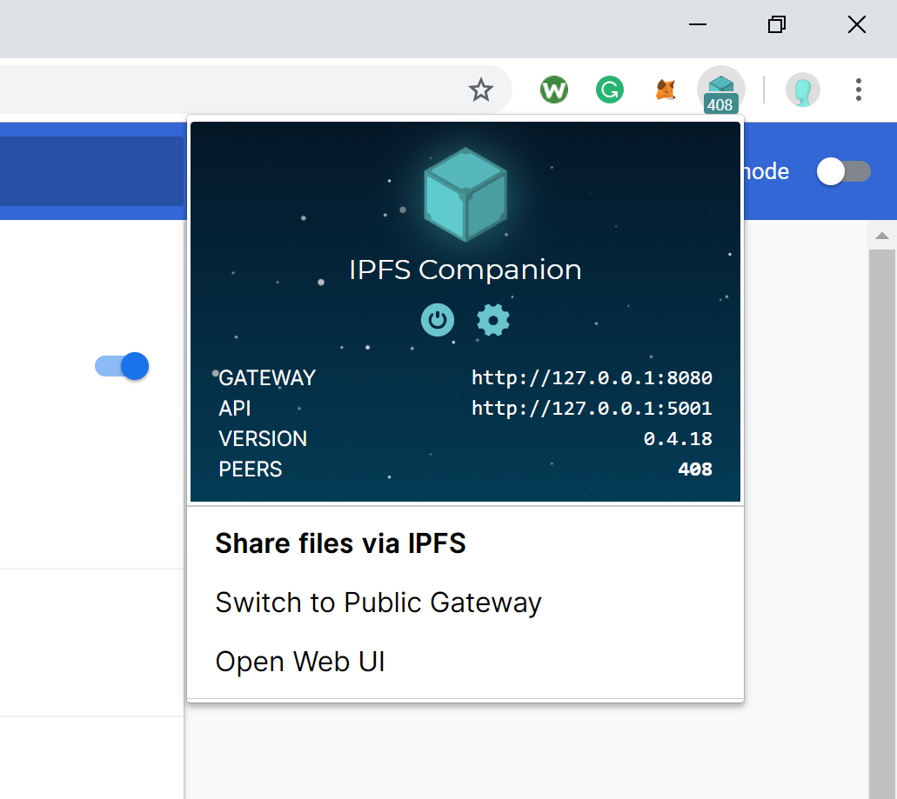
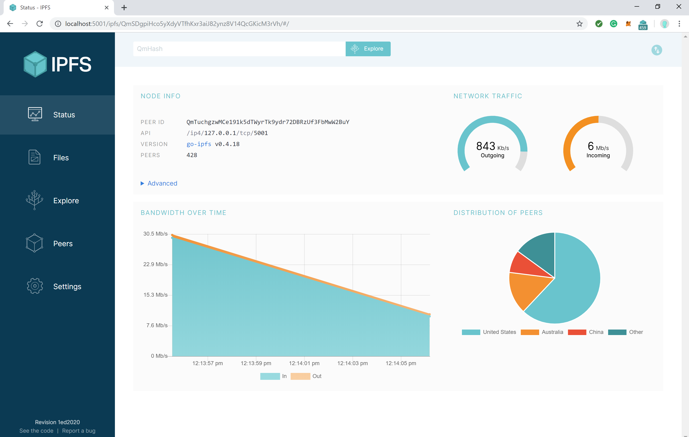
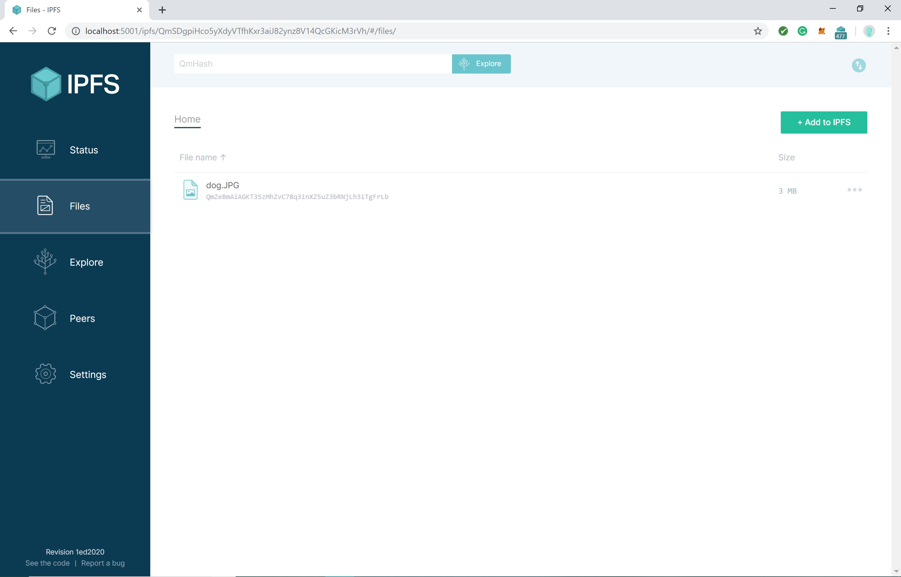
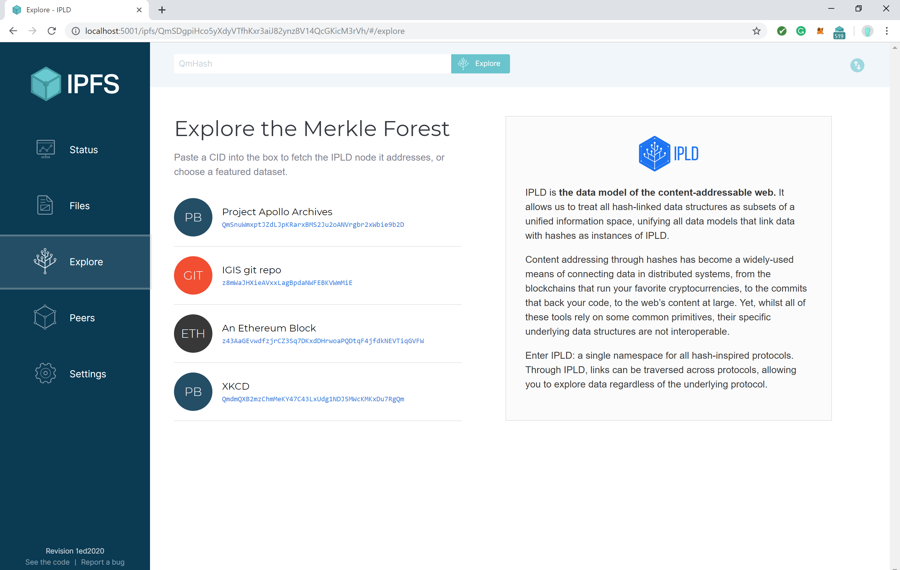
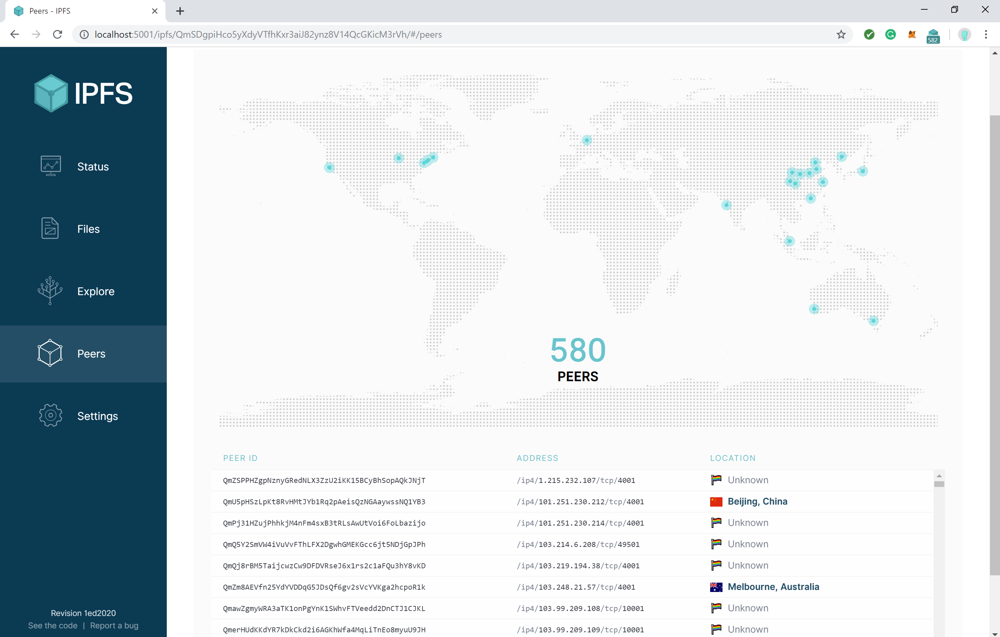

# Implementations

Before we install IPFS, here is a brief introductory to familiarize yourself with the different interfaces.

## Command Line Tool:

The IPFS protocol comes in two different languages: Go and JavaScript. In the future we can expect to see a Python implementation.

- **go-ipfs** : The main IPFS tool is a command line tool with a daemon server, HTTP API for controlling the node, and an HTTP gateway to serve content to HTTP browsers. It features all the commands necessary to control your own IPFS node.
- **js-ipfs** : The JavaScript browser implementation. Allows you to start an IPFS node directly in your program or control a node that is already running through HTTP API.

In our tutorial, we use the Go implementation. For more information on **js-ipfs** visit the [link.](https://js.ipfs.io/)

## Browser extension

The browser extension also known as the companion, allows the user to view short detailed information about their node. The companion is available on [Chrome](https://chrome.google.com/webstore/detail/ipfs-companion/nibjojkomfdiaoajekhjakgkdhaomnch?hl=en) and [Firefox.](https://addons.mozilla.org/en-US/firefox/addon/ipfs-companion/) Information includes version, gateway, API, and the number of peers connected. It has the capability to share files and switch to a custom or public gateway.

In the next tutorial we will not be covering the browser extension. To learn more click the [link](https://github.com/ipfs-shipyard/ipfs-companion).

## Local Webhost

Once you have connected to the daemon server, you can access your own personal web host to see the status of your node. You'll be able to read information such as network traffic, bandwidth, and peers. The local webhost is a more advanced version of the browser extension.

<http://localhost:5001/webui>

The status page allows the users to check information in regards to how their node is running on the network.

You can upload files to your node directly in the browsers as well as explore files on other nodes if you know the hash of the content.

The web interface is the ultimate tool for checking the status of your node and managing your files.
