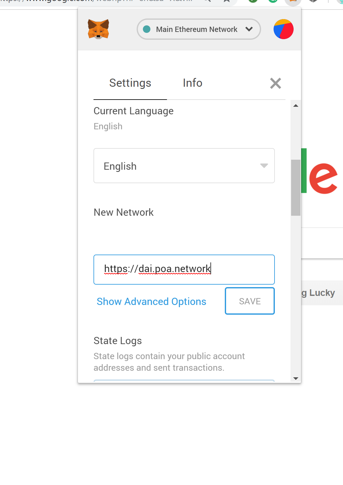
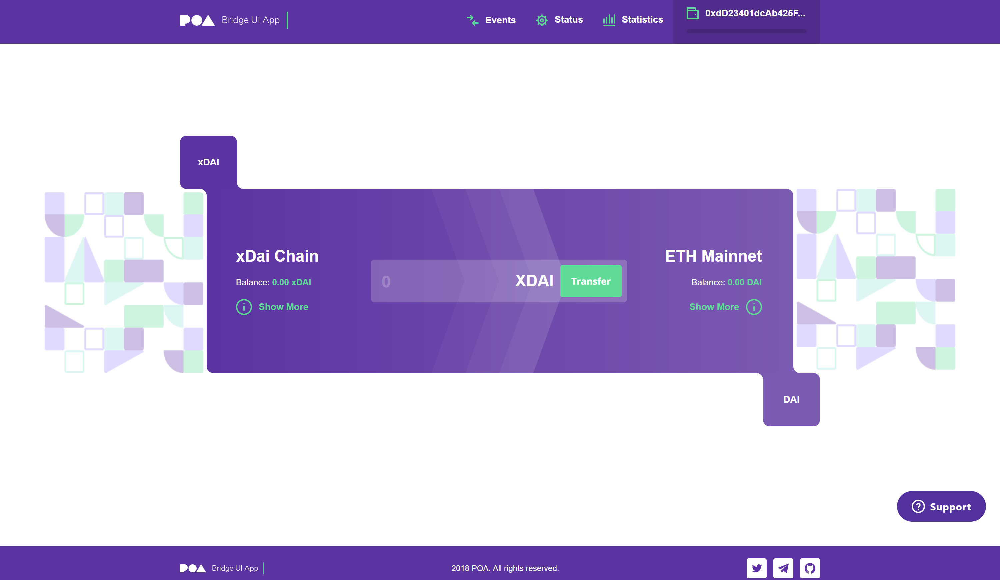

# The xDai Chain

## What is It?

xDai is a blockchain based on Ethereum that uses Dai as its currency. It features 5-second block speed, a gas price fixed at 1 GWei, free capacity for blocks, and a fixed platform usage price. Using a proof of autonomy consensus, it's a fast and cost-efficient chain.  

Fun Fact: The Burner Wallet featured at EthDenver 2019 ran on the xDai network! To learn more about its success follow the [link](https://medium.com/gitcoin/burner-wallet-at-ethdenver-was-faa3851ea833).

## What is Dai?

Dai is an ERC20 token that has a stable value. It's pegged to always be equal to 1 USD no matter how many Dai are in circulation.

On the Ethereum blockchain, even though Dai is its own currency, it still relies on Ether to pay for transactions and gas fees. These prices are constantly changing and as a result, the rate is different from day to day.

## The Solution

xDai is a chain that allows users to only deal with Dai. On this chain, the tokens will remain a 1:1 ratio with the USD currency, allowing it to be stable.

xDai tokens are not mintable; They're created by moving Dai over the xDai bridge that connects the Ethereum and xDai chains. Dai changes its name to xDai once it crosses over to the chain. The bridge allows for the user to use their tokens on both chains in their respective currencies.

 Dai is the only token that is convertible to xDai; POA tokens and Ether are not compatible. You must own Dai to cross the bridge.

## Chain Resources

-   Network ID: 100

-   RPC Endpoint : <https://dai.poa.network>

-   Block Explorer: <https://blockscout.com/poa/dai>

-   Network Status : <http://dai-netstat.poa.network>

-   xDai Token Bridge : <https://dai-bridge.poa.network/>

Using the [POA - Part 1 - Develop and deploy a smart contract](https://kauri.io/article/549b50d2318741dbba209110bb9e350e/v12/poa-part-1-develop-and-deploy-a-smart-contract) tutorial, there are minimal steps to change to allow us to deploy to xDai.

**Note: xDai is a real network, not a test network! Any contract you deploy will cost real xDai/Dai. The following steps show you how to deploy to the xDai network using the steps from the tutorial mentioned.**



Change your RPC endpoint to <https://dai.poa.network>.



Convert your Dai into xDai using the token bridge <https://dai-bridge.poa.network/>.

```javascript
require('dotenv').config();
const HDWalletProvider = require('truffle-hdwallet-provider');

module.exports = {
  // See <http://truffleframework.com/docs/advanced/configuration>
  // for more about customizing your Truffle configuration!
  networks: {
    xdai: {
          provider: function() {
                return new HDWalletProvider(
               process.env.MNEMONIC,
               "https://dai.poa.network")
          },
          network_id: 100,
          gas: 500000,
          gasPrice: 1000000000
    },
    development: {
          host: "127.0.0.1",
          port: 8545,
          network_id: "*" // Match any network id
    }
  }
};
```

Update your **truffle.js** file to the proper network.

`$ truffle migrate --network xdai`

Deploy to the xDai network.


Here is your Block explorer to check the status of your transactions.


Use the network status link to check the status of the chain nodes.

Documentation:

[More resources](https://forum.poa.network/t/xdai-chain-resources/1769)

<https://poa.network/xdai>
