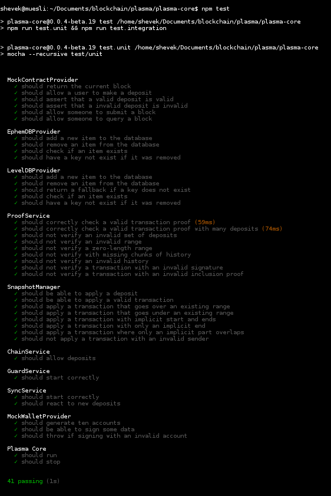
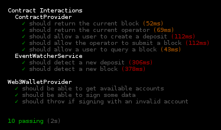
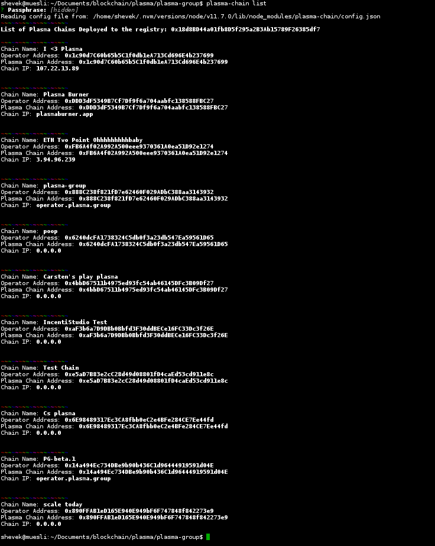

# Plasma Roundup: From MVP to Plasma Group

Ethereum second layer scaling technology has come a long way in a short period of time. Second layer solutions, innovations beyond the layer one protocol level, include State Channels, Side Chains and Plasma. Taken together, layer two technologies present a wide scope of possibility for scaling the Ethereum blockchain.

In August 2017, Plasma creators Joseph Poon and Vitalik Buterin [proposed this framework](https://plasma.io/plasma.pdf) for scaling Ethereum transaction throughput to a "significant amount of state updates per second," potentially more than Paypal, Visa or other widely used merchant service providers.

Aside from offering comparable, if not more, transactions per second Plasma stakes its security in the value of Ethereum’s decentralized mainchain rather than in a centralized merchant service.

The promise of Plasma lays in its potential to help scale blockchain technology by processing a substantial amount of decentralized financial applications worldwide.

In January 2018, Vitalik posted the [“Minimal Viable Plasma” (MVP) specification to the Ethereum Research Forums](https://ethresear.ch/t/minimal-viable-plasma/426). The specification was designed to offer simplicity and basic security properties to kickstart development. Teams immediately began building their own implementations.

This overview is not meant to be exhaustive. Instead, by highlighting a few implementations, it aims to be indicative of the progress that Plasma has made over the past year.

Although none of the Plasma models reviewed here are on mainnet or production ready, they show that this technology is not just theory. Taken together, the implementations suggest that Plasma is moving rapidly toward realizing the scaling potential that its creators and implementers envision.

## Prerequisites

For most of these projects you need Truffle, Ganache and npm installed.

## FourthState Labs

Among the early Plasma implementations was [FourthState Labs](https://github.com/FourthState/plasma-mvp-rootchain), whose design included a rootchain contract according to the Plasma MVP. This rootchain, which other projects have also incorporated, is a series of Solidity smart contracts. Follow these steps to test them:

```shell
git clone https://github.com/fourthstate/plasma-mvp-rootchain
cd plasma-mvp-rootchain
npm install
ganache-cli // In seperate terminal window
npm test
```


<!-- TODO: Running? -->

## OmiseGO

Other notable early MVP's include [OmiseGO's research implementation](https://github.com/omisego/plasma-mvp), which has a root chain, child chain and a client to interact with the Plasma chain.

## Kyokan Plasma

Moving beyond research, [Kyokan](https://github.com/kyokan/plasma) introduced their Golang implementation [extending the original MVP specification](https://kauri.io/article/7f9e1c04f3964016806becc33003bdf3/v4/minimum-viable-plasma-the-kyokan-implementation). Kyokan uses the FourthState rootchain contract reviewed above. The architecture includes root nodes to process transactions and package them into blocks, broadcasts blocks to validator nodes, processes exits and more.

In Kyokan, validator nodes check the validity of blocks and exit if bad behavior is detected. The Plasma contract lives on the Ethereum root chain and supports deposits, block submissions, exits and challenges. Kyokan, which aims to provide a pluggable architecture, has deployed their [Plasma Block Explorer](https://explorer.kyokan.io/) on the Rinkeby test net:


## Plasma Group

Closing 2018, the [Plasma Group](https://plasma.group/) [announced the release of their implementation](https://medium.com/plasma-group/plasma-spec-9d98d0f2fccf) aimed at the greater Ethereum community. It includes a Plasma chain operator, a client and command line wallet, support for ERC20 tokens, a block explorer, transaction load testing and more.

Many aspects of [this implementation are testable](https://github.com/plasma-group). To test the [Plasma Core](https://github.com/plasma-group/plasma-core) follow these steps:

```shell
git clone git@github.com:plasma-group/plasma-core.git
cd plasma-core
npm install
npm test
```




To run Plasma Group's [chain operator](https://github.com/plasma-group/plasma-chain-operator), follow these steps:

```shell
npm install plasma-chain -g
plasma-chain account new
```

Use the [Rinkeby testnet faucet](https://faucet.rinkeby.io/) to send your Operator address ~0.5 ETH.

List all the Plasma chains which others have deployed to the Plasma Network Registry.

```shell
plasma-chain list
```



```shell
plasma-chain deploy # the cli will warn you that deplyment takes time. it does.
plasma-chain start
```

Optionally, if you want to send test transactions to your chain run `plasma-chain testSwarm`.

To spin up Plasma Group's block explorer, assuming the same environment as above, do the following:

```shell
git clone https://github.com/plasma-group/plasma-explorer
npm install
npm run serve
```

View the local block explorer at _<http://127.0.0.1:8000>_. If that does not work you may need to forward traffic from port 80 to port 3000 with this command:

```shell
sudo iptables -t nat -I OUTPUT -p tcp -d 127.0.0.1 --dport 80 -j REDIRECT --to-ports 3000
```


## Summary

Overall, Plasma seems to be making a great leap forward, but there are still a few obstacles to overcome. Implementations need to be audited and tested. With mass adoption and the potential for global application, the stakes are high for these chains which, if all goes according plan, will be processing a significant number of states per second, each state possibly holding very high value. These implementations may suggest that layer two Plasma technology is right around the corner, but careful engineering to protect users and avoid risk will take time.
